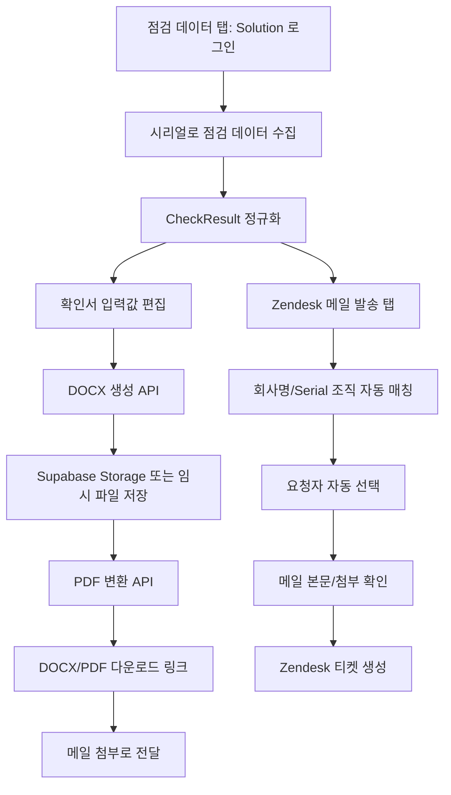

# 점검 확인서 DOCX/PDF 웹 이식 상세 기획

## 1. 결론

현재 웹앱에는 점검 데이터 기준 DOCX/PDF 생성 기능이 없다. 기존 `checkserverapp.exe`에는 `DocxService` 기반으로 구현되어 있으며, 웹 이식 시 단순 다운로드 버튼만 추가하면 품질 문제가 생긴다.

이 작업은 할 수 있다. 다만 PDF까지 안정적으로 제공하려면 DOCX 생성과 PDF 변환을 분리해야 한다. 특히 기존 exe의 PDF는 Windows Word COM 변환을 사용하므로 Vercel 환경에서 그대로 재사용할 수 없다.

권장 방향은 다음이다.

- 웹 UI는 탭을 분리한다.
- 점검 데이터 탭에서 데이터 수집, 결과 확인, DOCX/PDF 생성, 생성 파일 첨부 준비를 처리한다.
- Zendesk 메일 발송 탭에서는 조직/요청자 매칭, 메일 본문, 첨부, 발송만 처리한다.
- DOCX는 기존 템플릿 기반으로 서버에서 생성한다.
- PDF는 별도 변환 엔진을 둔다. 운영 안정성을 우선하면 LibreOffice/Gotenberg 계열 변환 서비스를 분리하는 방식이 가장 안전하다.

## 2. 기존 exe 문서 생성 구조

기존 구현 위치:

- `check_server_app_py/app/services/docx_service.py`
- `check_server_app_py/app/ui/result_window.py`
- 템플릿 후보: `정기점검확인서_양식_py.docx`, `build_assets/template.docx`

기존 동작:

1. 점검 결과를 `CheckResult` 모델로 정리한다.
2. 사용자가 회사명, 시리얼, 제품명, 점검자, 의견, 서명 이미지를 조정한다.
3. `DocxService.render()`가 템플릿을 연다.
4. placeholder context를 채운다.
5. 서명 이미지를 crop/trim 후 삽입한다.
6. 템플릿 렌더 후 표 내용을 추가 보정한다.
7. 점검 항목 정상/이상 표시를 표 셀에 후처리한다.
8. 비고/요약 테이블/서명 칸 정렬을 다시 보정한다.
9. Windows Word COM으로 PDF를 생성한다.
10. 생성된 DOCX/PDF를 메일 첨부 목록으로 넘긴다.

중요 포인트:

- 기존 문서는 `docxtpl` 렌더링만으로 끝나지 않는다.
- 결과 표, 비고 셀, 서명 칸 정렬, 월간 보고서/백업/보안 상태 같은 후처리가 핵심이다.
- PDF 변환은 Word COM 의존이라 웹 서버에서는 다른 방식이 필요하다.

## 3. 웹 UI 재구성

### 3.1 상위 구조

현재 한 화면에 점검 데이터, Zendesk 조직 검색, 메일 작성이 모두 붙어 있다. 앞으로는 탭을 나눈다.

권장 탭:

1. `점검 데이터`
2. `Zendesk 메일 발송`

### 3.2 점검 데이터 탭

역할:

- Solution API 로그인
- 시리얼 입력 및 점검 데이터 수집
- 점검 결과 요약 표시
- 원본 주요 값 표시
- 확인서 입력값 보정
- DOCX 생성
- PDF 생성
- 생성 파일을 메일 첨부로 넘기기

필요 UI:

- Solution 로그인 영역
- 시리얼 입력 영역
- 점검 결과 요약 카드
- 확인서 편집 영역
  - 회사명
  - 시리얼
  - 제품명
  - 점검자
  - 점검 의견
  - 점검자 서명 선택
  - 고객 서명은 기본 공란 또는 추후 업로드
- 문서 생성 버튼
  - `DOCX 생성`
  - `PDF 생성`
  - `DOCX/PDF 생성 후 메일 첨부`
- 생성 결과
  - 파일명
  - 생성 시각
  - DOCX 다운로드
  - PDF 다운로드
  - 메일 첨부 상태

### 3.3 Zendesk 메일 발송 탭

역할:

- 점검 데이터 탭에서 넘어온 회사명/시리얼 기반 조직 자동 매칭
- Zendesk 조직 수동 검색
- 요청자 자동 선택 및 수동 선택
- exe 기준 메일 제목/본문 자동 생성
- 생성 문서 첨부 확인
- Zendesk 티켓 생성 및 발송

필요 UI:

- 자동 매칭 상태
- 조직 검색/선택
- 요청자 선택
- 메일 제목/본문
- 첨부 목록
- 발송 설정
- 최종 확인 모달
- 발송 이력

## 4. 데이터 흐름



## 5. 서버 API 설계

### 5.1 문서 생성 API

`POST /api/documents/check-report`

권한:

- `operator` 이상

입력:

```json
{
  "checkResult": {},
  "manual": {
    "companyName": "고객사명",
    "serial": "LO00000000",
    "productName": "오피스키퍼",
    "engineerName": "점검자",
    "opinion": "점검 의견",
    "engineerSignatureKey": "signatures/name.png",
    "customerSignatureKey": null
  },
  "output": {
    "docx": true,
    "pdf": true
  }
}
```

출력:

```json
{
  "documentId": "uuid",
  "docx": {
    "fileName": "정기점검확인서_고객사_260430.docx",
    "downloadUrl": "signed-url"
  },
  "pdf": {
    "fileName": "정기점검확인서_고객사_260430.pdf",
    "downloadUrl": "signed-url",
    "status": "success"
  }
}
```

### 5.2 PDF 변환 API

`POST /api/documents/check-report/{documentId}/pdf`

권한:

- `operator` 이상

역할:

- 생성된 DOCX를 PDF로 변환
- 변환 실패 시 DOCX는 유지하고 PDF 상태만 실패로 저장
- 사용자에게 실패 사유 요약 표시

### 5.3 문서 다운로드 API

`GET /api/documents/{documentId}/download?type=docx|pdf`

권한:

- 생성자 본인 또는 admin

보안:

- public URL 고정 노출 금지
- 짧은 TTL signed URL 사용
- 문서 생성/다운로드 audit log 기록

## 6. 저장소 설계

Supabase Storage bucket:

- `generated-documents`
- private bucket
- public read 금지
- insert/update/delete는 service role 서버 API만 수행
- 다운로드는 signed URL만 발급

DB 테이블:

`generated_documents`

필드:

- `id`
- `created_by`
- `company_name`
- `serial`
- `docx_path`
- `pdf_path`
- `pdf_status`: `not_requested`, `pending`, `success`, `failed`
- `pdf_error_summary`
- `attached_to_mail`: boolean
- `created_at`
- `expires_at`

보관 정책:

- 기본 30일 보관
- 수동 삭제 기능은 admin만
- 추후 정리 job 추가

## 7. DOCX 생성 전략

### 7.1 템플릿

기존 `정기점검확인서_양식_py.docx`를 웹 프로젝트에 명시적으로 포함한다.

추천 위치:

- `src/templates/check-report/template.docx`

주의:

- 사용자가 올린 sidecar 템플릿을 자동으로 잡지 않는다.
- exe와 동일하게 운영 템플릿 하나를 고정한다.
- 템플릿 변경 시 버전 관리한다.

### 7.2 렌더링 방식

Node.js에서 DOCX zip XML을 처리하는 방식으로 구현한다.

필요 작업:

- placeholder 치환
- 반복/조건은 최소화
- 텍스트 스타일 보존
- 표 셀 값 보정
- 정상/이상 표시 셀 보정
- 비고 셀 보정
- 서명 셀 정렬 보정
- 서명 이미지 삽입

후보 라이브러리:

- `docxtemplater`
- `pizzip`
- `@xmldom/xmldom`

주의:

- 기존 Python의 `python-docx` 후처리와 1:1 대응이 필요하다.
- 단순 템플릿 치환만으로는 기존 품질을 맞추기 어렵다.

### 7.3 매핑 항목

기존 `DocxService._build_context()` 기준으로 우선 이식한다.

핵심 context:

- `company_name`
- `serial`
- `product_name`
- `request_date`
- `vendor_name`
- `check_dept`
- `engineer_name`
- `check_date`
- `docker_version`
- `license_summary`
- `last_reboot`
- `mysqld_status`
- `httpd_status`
- `security_status`
- `agent_status`
- `mail_status`
- `web_status`
- `monthly_report_status`
- `backup_status`
- `ntp_sync_status`
- `hr_sync_status`
- `hr_sync_db`
- `agent_version`
- `os_info`
- `server_model`
- `cpu_usage`
- `total`
- `actual`
- `disk_root`
- `disk_home`
- `disk_storage`
- `opinion`
- `sign_customer_img`
- `sign_engineer_img`

## 8. PDF 생성 전략

### 8.1 중요한 제약

기존 exe는 Windows Word COM으로 PDF를 만든다. Vercel 서버에서는 이 방식을 사용할 수 없다.

Vercel 단독으로 DOCX를 PDF로 안정 변환하는 방식은 제한이 크다. 특히 한글 폰트, 표 레이아웃, 서명 위치까지 기존 Word 출력과 동일하게 맞추려면 별도 변환 엔진이 필요하다.

### 8.2 권장안

운영 권장:

- DOCX 생성은 Vercel API에서 수행
- PDF 변환은 별도 변환 서비스에서 수행
- 변환 서비스는 LibreOffice 기반
- 예: 사내 서버, Docker 기반 변환 API, Gotenberg 계열

장점:

- Word 문서 기반 PDF 변환 품질이 가장 안정적
- Vercel 함수 크기/실행시간/바이너리 제약을 피할 수 있음
- 실패 시 DOCX는 정상 제공 가능

단점:

- 변환 서비스 운영 필요
- 내부 API 인증 필요

### 8.3 대안

대안 A: HTML 기반 PDF 생성

- 점검 확인서를 HTML/CSS로 재구성
- 서버 또는 브라우저에서 PDF 생성
- DOCX와 PDF가 서로 다른 렌더링 경로가 됨

장점:

- 웹 환경에서 구현이 비교적 단순
- PDF 품질 제어가 쉬운 편

단점:

- 기존 DOCX 템플릿과 100% 동일하게 맞추기 어렵다.
- 같은 문서의 DOCX/PDF가 미세하게 다를 수 있다.

대안 B: DOCX만 우선, PDF는 2단계

- 1차 배포에서 DOCX 생성/첨부까지 완료
- PDF 변환 서비스 준비 후 2차 배포

장점:

- 핵심 업무 흐름을 빠르게 복구
- 위험이 낮다.

단점:

- 사용자가 원하는 PDF가 즉시 제공되지 않는다.

권장 결정:

- 사용자가 PDF를 원하므로 1차부터 PDF 버튼은 제공한다.
- 단, 변환 실패 시 DOCX는 반드시 제공하고, PDF 실패 사유를 표시한다.

## 9. 서명 처리

점검자 서명:

- 기존 `signatures/{engineerName}.png` 구조를 Supabase Storage로 이관한다.
- bucket은 private 또는 public read only 중 선택한다.
- 수정/업로드는 admin API로만 허용한다.

고객 서명:

- 초기 버전은 공란 유지
- 추후 업로드 또는 캔버스 서명 입력 기능 추가 가능

서명 정렬:

- 기존 이슈가 있었으므로 별도 테스트 케이스로 고정한다.
- 이름은 중앙, 서명은 오른쪽에 가까운 배치가 되도록 템플릿/후처리 둘 다 확인한다.

## 10. 메일 첨부 연동

문서 생성 후 흐름:

1. 점검 데이터 탭에서 DOCX/PDF 생성
2. 생성된 파일을 `generatedDocuments` 상태에 저장
3. `메일 첨부로 추가` 버튼 클릭
4. Zendesk 메일 발송 탭 첨부 목록에 DOCX/PDF 표시
5. 발송 시 기존 업로드 API로 Zendesk upload token 생성

주의:

- 현재 첨부 API는 브라우저 `File` 기준이다.
- 서버에 이미 저장된 생성 문서는 별도 upload 경로가 필요하다.
- `POST /api/zendesk/uploads`가 generated document id를 받을 수 있도록 확장하거나, 별도 `POST /api/zendesk/uploads/generated`를 만든다.

권장:

- 일반 파일 업로드와 생성 문서 업로드를 분리한다.
- 생성 문서 첨부는 서버에서 Storage 파일을 읽어 Zendesk upload API로 전송한다.

## 11. 보안 설계

필수:

- 모든 `/api/documents/*`는 `requireRole()` 적용
- `operator` 이상만 생성
- 생성자 본인 또는 admin만 다운로드
- Storage private bucket 사용
- signed URL TTL 짧게 설정
- 문서 생성/다운로드/삭제 audit log 기록
- 파일명에는 민감한 값 최소화
- PDF 변환 서비스 호출에는 server-only secret 사용

Preview 환경:

- Zendesk 실발송은 현재처럼 차단
- 문서 생성은 허용 가능
- 단, Preview에서 생성된 문서는 별도 bucket prefix 사용 권장

## 12. 구현 단계

### Phase 1: UI 구조 분리

- 현재 화면을 탭 구조로 변경
- `점검 데이터` 탭과 `Zendesk 메일 발송` 탭 분리
- 점검 결과 상태를 상위 컴포넌트에서 관리
- 메일 탭은 점검 결과를 받아 조직 자동 매칭과 메일 양식 생성

완료 기준:

- 점검 데이터와 메일 발송 UI가 분리됨
- 현재 Zendesk 발송 기능이 깨지지 않음

### Phase 2: DOCX 생성 기반 작업

- 기존 템플릿을 웹 프로젝트로 복사
- `CheckResult`를 문서 context로 변환하는 mapper 작성
- `POST /api/documents/check-report` 추가
- DOCX 생성 후 Storage 저장
- DOCX 다운로드 제공

완료 기준:

- 점검 데이터로 DOCX 다운로드 가능
- 기존 exe 산출물과 주요 표/값 비교 통과

### Phase 3: DOCX 후처리 이식

- 정상/이상 체크 셀 보정
- 비고 셀 보정
- 요약 테이블 보정
- 서명 칸 정렬 보정
- 월간 보고서/백업/보안/인사연동 상태 표시 보정

완료 기준:

- 기존 템플릿 기준 주요 셀 값이 정확히 채워짐
- 서명 위치가 요구 수준으로 표시됨

### Phase 4: PDF 변환

- PDF 변환 방식 확정
- 변환 API 추가
- 변환 성공/실패 상태 저장
- PDF 다운로드 제공

완료 기준:

- DOCX 생성 후 PDF도 생성 가능
- 실패 시 DOCX는 정상 제공
- 실패 사유가 사용자에게 표시됨

### Phase 5: Zendesk 첨부 연동

- 생성 문서를 메일 첨부 목록에 추가
- generated document upload API 추가
- 발송 시 DOCX/PDF가 Zendesk 티켓에 첨부됨

완료 기준:

- 점검 데이터 수집 → 문서 생성 → 메일 첨부 → Zendesk 발송 흐름이 웹에서 완료됨

### Phase 6: 검증

- `npm run typecheck`
- `npm run lint`
- `npm run build`
- 샘플 점검 데이터로 DOCX 생성
- DOCX XML/텍스트 검증
- PDF 렌더링 검증
- Zendesk dry-run preview 검증
- Production 실발송 전 최종 확인

## 13. 주요 리스크

### 리스크 1: PDF 품질

DOCX 기반 PDF를 Vercel 안에서 직접 변환하려 하면 품질과 안정성이 흔들릴 수 있다.

대응:

- PDF 변환 엔진 분리
- 변환 실패 시 DOCX는 제공

### 리스크 2: 기존 템플릿 후처리 복잡도

기존 Python 코드는 표/셀을 많이 직접 수정한다.

대응:

- 한 번에 전체 이식하지 말고 값 매핑 → 체크 표시 → 비고 → 서명 순서로 단계화
- 샘플 문서 비교를 검증 기준으로 둔다.

### 리스크 3: 한글/폰트/서명 위치

환경에 따라 PDF 레이아웃이 달라질 수 있다.

대응:

- 변환 서비스에 고정 폰트 설치
- 서명 셀 테스트 케이스 유지

### 리스크 4: 생성 문서 보안

문서에는 고객사명, 시리얼, 점검 결과가 포함된다.

대응:

- private bucket
- signed URL
- role check
- audit log
- 보관 기간 제한

## 14. 우선 결정 필요 사항

1. PDF 변환을 별도 서비스로 둘지
2. DOCX와 PDF를 항상 둘 다 만들지, 사용자가 선택하게 할지
3. 생성 문서 보관 기간
4. 점검자 서명을 Supabase Storage로 이전할지
5. 고객 서명은 초기 버전에서 공란 유지할지

## 15. 권장 구현 방향

현실적인 권장안:

1. 먼저 탭 구조를 분리한다.
2. DOCX 생성부터 기존 템플릿 기준으로 구현한다.
3. 생성된 DOCX를 메일 첨부로 넘기는 흐름을 완성한다.
4. PDF는 별도 변환 서비스 연동 방식으로 붙인다.
5. PDF 변환 실패가 있어도 업무가 중단되지 않도록 DOCX fallback을 보장한다.

이 순서가 가장 안전하다. PDF를 처음부터 Vercel 내부에서 억지로 처리하면 배포는 빨라 보여도 운영 중 문서 품질 문제와 변환 실패 가능성이 커진다.
